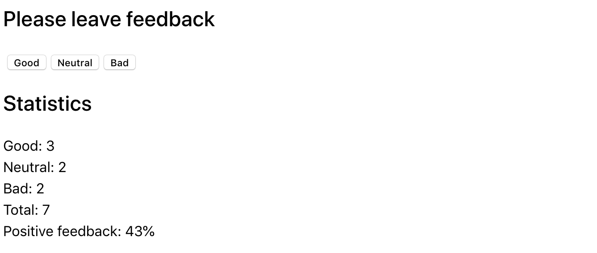
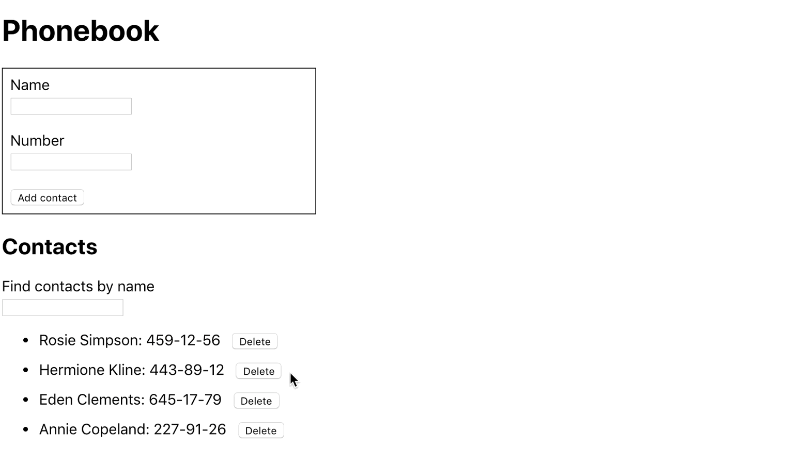

# react-homework-02

## 1 - Feedback Widget

Like most companies, Expresso Cafe collects reviews from its customers. Your task is to create an application to collect statistics. There are only three options for feedback: good, neutral, and bad.

### Step 1

The app should display the number of reviews collected for each category. The app should not save review statistics between different sessions (page refresh).

The state of the application must be of the following form, no new properties must not be added.

```
state = {
  good: 0,
  neutral: 0,
  bad: 0
}
```

The interface might look like this.


### Step 2

Expand the app's functionality so that the interface displays more
statistics about the collected feedback. Add a display of the total number of collected
reviews from all categories and the percentage of positive reviews. To do this, create
helper methods `countTotalFeedback()` and
`countPositiveFeedbackPercentage()` methods that calculate these values based on
state data (computable data).


### Step 3

Perform a refactoring of the application. The state of the application must remain in the
`<App>` root component.

- Put the statistics display in a separate component
  `<Statistics good={} neutral={} bad={} total={} positivePercentage={}`
- Put the button box into a component
  `<FeedbackOptions options={} onLeaveFeedback={}`
- Create a component `<Section title="">` that renders a section with title and
  (children). Wrap each of the `<Statistics>` and `<FeedbackOptions>` in the
  created section component.

### Step 4

Extend the functionality of the application so that the statistics block is rendered only after
after at least one feedback has been collected. The message about absence of statistics
put in the component `<Notification message="There is no feedback">`.


## 2 - Contact Book

Write an application to store your phonebook contacts.

### Step 1

The application should consist of a form and a list of contacts. In the current step, implement
adding a contact name and displaying a list of contacts. The application should not
save contacts between different sessions (page refresh).

Use this input markup with built-in validation for the contact name.

```
<input
  type="text"
  name="name"
  pattern="^[a-zA-Zа-яА-Я]+(([' -][a-zA-Zа-яА-Я ])?[a-zA-Zа-яА-Я]*)*$"
  title="Name may contain only letters, apostrophe, dash and spaces. For example Adrian, Jacob Mercer, Charles de Batz de Castelmore d'Artagnan."
  required
/>
```

The state held in the parent component `<App>` must necessarily be The following form, you can not add new properties.

```
state = {
  contacts: [],
  name: ''
}
```

Each contact must be an object with properties `name` and `id`. To generate
identifiers, use any suitable package, e.g.
[nanoid](https://www.npmjs.com/package/nanoid). After completing this step,
the application should look something like this.


### Step 2

Expand the functionality of the app by allowing users to add numbers
phone numbers. To do this, add `<input type="tel">` to the form, and a property to
store its value in the state.

```
state = {
  contacts: [],
  name: '',
  number: ''
}
```

Use this markup of an instance with built-in validation for the contact number.

```
<input
  type="tel"
  name="number"
  pattern="\+?\d{1,4}?[-.\s]?\(?\d{1,3}?\)?[-.\s]?\d{1,4}[-.\s]?\d{1,4}[-.\s]?\d{1,9}"
  title="Phone number must be digits and can contain spaces, dashes, parentheses and can start with +"
  required
/>
```

After completing this step, the application should look something like this.


### Step 3

Add a search field that you can use to filter your contact list by name.

- The search field is a formless input whose value is written to the state (controlled item).
- The filtering logic should be case insensitive.

```
state = {
  contacts: [],
  filter: '',
  name: '',
  number: ''
}
```


When we work on new functionality, it can be convenient to hardcode some data into a state. This eliminates the need to manually enter data in the interface to test the new functionality. For example, you can use this initial state.

```
state = {
  contacts: [
    {id: 'id-1', name: 'Rosie Simpson', number: '459-12-56'},
    {id: 'id-2', name: 'Hermione Kline', number: '443-89-12'},
    {id: 'id-3', name: 'Eden Clements', number: '645-17-79'},
    {id: 'id-4', name: 'Annie Copeland', number: '227-91-26'},
  ],
  filter: '',
  name: '',
  number: ''
}
```

### Step 4

If your application is implemented in a single component `<App>`, perform
refactoring by separating the appropriate parts into separate components. In the state of the
root component `<App>` will leave only the `contacts` and `filter` properties.

```
state = {
  contacts: [],
  filter: ''
}
```

Four components are enough: add contact form, contact list, contact list item, and search filter.

After the refactoring, the root component of the application will look like this.

```
<div>
  <h1>Phonebook</h1>
  <ContactForm ... />

  <h2>Contacts</h2>
  <Filter ... />
  <ContactList ... />
</div>
```

### Step 5

Deny the user the ability to add contacts whose names are already in the phonebook. If you try to do so, show `alert` with a warning.


### Step 6

Extend the functionality of the app by allowing the user to delete previously saved contacts.

